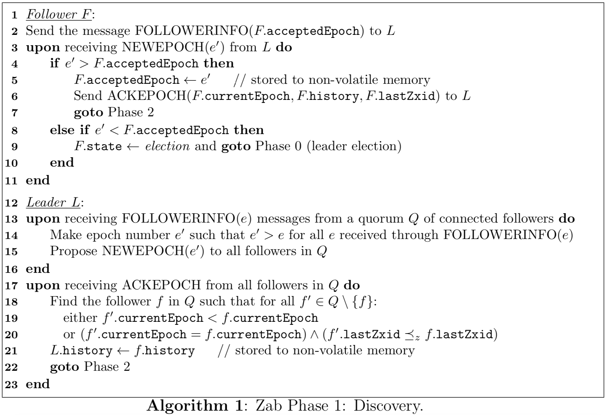

# 
ZooKeeper原子广播协议理论与实践

Andr ́e Medeiros 
March 20, 2012 

### 
摘要

Apache ZooKeeper是云计算领域的分布式协调服务，为其他分布式应用程序提供基本的同步和组服务。其核心在于原子广播协议，该协议选举一个Leader节点，同步各个节点，并广播Leader节点的更新。我们研究这个协议的设计，highlight promised properties，并分析Apache的官方实现。特别是，详细研究默认的Leader选举协议。

## 一、介绍
ZooKeeper [8, 10, 11, 12, 19]是一种容错分布式协调服务，用于云计算应用程序，当前由Yahoo!和Apache软件基金会维护。它通过封装分布式协调算法并维护一个简单的数据库，为其他云计算应用程序提供基础服务。
该服务旨在提供高可用性和高可靠性，因此多个客户端进程依靠它进行引导(_bootstrap_)、存储配置数据，进程运行的状态，组成员关系，以及实现同步原语以及管理故障恢复。它通过复制实现可用性和可靠性，在以读为主的场景中具有良好的性能[12]。
ZooKeeper数据库的整个副本复制是在一个集群(_ensemble_)上执行的，即多个主机服务器，通常配置三个或五个，其中一个是quorum（即大多数）的leader。只要存在大多数机器可用，服务就会被视为可用。ZooKeeper的一个关键组件是Zab，即ZooKeeper Atomic Broadcast算法，它是管理对副本进行原子更新的协议。它负责选举leader，同步副本，管理要广播的更新事务，以及从崩溃状态恢复到有效状态。我们在本报告中详细研究Zab。
本报告大纲如下。原子广播协议的背景知识在下一节中给出。在第3节中，我们介绍了Zab的设计，而在第4节中，我们对其实现进行讲解，并以第5节的结论结束。本报告的主要参考文献[12,19]。

## 二、背景
广播算法将来自一个进程(_process_)（主进程）的消息传输到网络或广播域中的所有其他进程（包括主进程）。原子广播协议是分布式算法，可以保证正确广播或中止（无其它影响）。它是用于群体通信的分布式计算中广泛使用的原语。原子广播也可以定义为满足总体顺序的可靠广播[3]，即满足以下性质[4]：
* **Validity**：如果一个正确的进程广播一条消息，那么所有正确的过程最终都会提交(deliver)它。
* **Uniform Agreement**：如果一个进程提交了一条消息，那么所有正确的进程最终都会提交该消息。
* **Uniform Integrity**：对于任何消息m，每个进程最多提交一次m，并且仅当m先前由m的发送者广播。
* **Uniform Total Order**：如果进程p和q都提交消息m和m'，则p在m'之前提交m，当且仅当q在m'之前提交m。

**Paxos [14, 15]是解决分布式共识的传统协议。 它最初不是用于原子广播，但它已经在D ́efago等人的论文《Total order broadcast and mul- ticast algorithms: Taxonomy and survey》 [4]中提到共识协议如何用于原子广播。** Paxos被考虑在ZooKeeper中被使用，但是 **它不能满足服务需要的一些关键属性。** 这些属性在2.3节中描述。Zab旨在满足ZooKeeper的要求，同时保持与Paxos的一些相似性。有关Paxos的更多详细信息，请参阅[15]。

### 1. Paxos和Zab的设计决策
Zab的两个重要要求[12]如下：
1. 支持同时处理多个未完成(_outstanding_)的客户端操作。
        一个未完成事务的含义是事务已经提出提议但没有被提交。
2. 有效的从崩溃状态恢复过来。

为了获得高性能，Zookeeper能并发的处理多个客户端的未完成写请求，并且以FIFO顺序提交这些写操作是很重要的。此外，这对于zookeeper在leader崩溃后能够有效的从崩溃状态恢复过来也是至关重要的。

**原始的Paxos协议不能同时处理多个未完成事务，Paxos不要求通信时的FIFO通道特性，Paxos可以容忍消息丢失和重新排序。** 如果两个未完成事务具有顺序依赖性，那么Paxos不能有多个未完成事务，因为不能保证FIFO的顺序。这个问题可以通过将多个事务打包成一个提案并一次最多允许一个提案来解决，但这具有性能缺陷。

**在Paxos [12]中，从primary crash中恢复（leader故障恢复）所使用的事务的序列化(_the sequence of transactions_)不够有效。Zab通过使用事务标识（事务ZXID）方案来对事务进行完全排序(_totally order_)，从而改进这个方面。** 在这种情况下，为了能更新一个new primary的应用程序状态，在zab中new primary会被期望拥有最高事务ID的进程，整个集群可以通过从new primary中拷贝事务，从而所有数据副本都可以达到一个一致性。

而在paxos，没有采用类似zab的序列号，所以一个新的primary需要执行Paxos算法的第一阶段，以便于获取到所有primary没有学习到值。

ZooKeeper的其他性能要求[19]包括：
1. 低延迟；
2. 突发情况下的高吞吐量，处理写入负载快速增加的情况，例如大规模系统重新配置；
3. 故障处理，当一些非leader服务器崩溃时，服务可以保持可用。

### 2. 故障恢复系统模型
ZooKeeper将故障恢复模型假定为系统模型[12]。进程集合Π = {p1,p2,...,pN}，通过消息传递进行通信，每个进程都有各自的存储，并且可能会崩溃并恢复无限多次。Π的大多数(_quorum_)是子集Q⊆Π，使得|Q| > N/2。任何两个quorum都有一个非空的交集。进程有两个状态：up，down。
对于Π中的每一对进程，都有一个双向通道，预期它将满足以下性质：
* **integrity**: 进程pj从pi接收消息m，当且仅当只有在pi已经发送了消息m时;
* **prefix**: 如果进程pj接收到消息m并且在pi发送给pj的消息序列中存在m之前的消息m'，则pj在m之前接收m'。

为了实现这些属性，ZooKeeper使用TCP（FIFO）通道进行通信。

### 3. 预期的属性
为保证进程的一致性，Zab要满足一些安全属性。此外，为了允许多个未完成的操作，我们需要主进程(_primary_)排序属性。

为了陈述这些属性，我们首先需要一些定义。

在ZooKeeper的崩溃恢复模型中，如果主进程崩溃，则需要选举新的主进程。由于广播消息是完全有序的，我们一次最多只需要一个主进程。所以随着时间的推移，我们得到一个无限制的主进程序列ρ1ρ2 . . . ρe . . .，其中ρe∈Π，e是一个被称为epoch的整数。如果e < e′，则ρe优先于ρe'，表示为ρe≺ρe'。

事务是主进程广播(_broadcasts_)到集群的状态更改，并由一对⟨v,z⟩表示，其中v是新的状态，z是标识符，称为zxid。_Transactions are first proposed to a process by the primary, then delivered (“committed”) at a process upon a specific call to a delivery method._

以下属性对于一致性是必要的[12]：
* **Integrity**: 如果某个进程提交了⟨v, z⟩，则某个进程已经广播了⟨v, z⟩。
* **Total order**: 如果某个进程在⟨v′, z′⟩之前提交了⟨v, z⟩，则任何提交⟨v′, z′⟩的进程也必须在⟨v′, z′⟩之前提交⟨v, z⟩。
* **Agreement**: 如果某个进程pi提交了⟨v, z⟩，并且某个进程pj提交了⟨v′, z′⟩，那么要么pi进程提交了⟨v′, z′⟩，要么pj提交了⟨v, z⟩。

主进程排序属性[12]在下面给出：

* **Local primary order**: 如果主进程在广播⟨v′, z′⟩之前广播⟨v, z⟩，那么一个提交⟨v′, z′⟩的进程必须在⟨v′, z′⟩之前提交⟨v, z⟩。
* **Global primary order**: 假设主进程ρi广播⟨v, z⟩和主进程ρj（ρj≻ρi）广播⟨v′, z′⟩。如果一个进程提交⟨v, z⟩ 和 ⟨v′, z′⟩，那么它必须在⟨v′, z′⟩之前提交⟨v, z⟩。
* **Primary integrity**: 如果主进程ρe广播⟨v, z⟩，并且某个进程提交由ρe′（ρe′ ≺ ρe）广播的⟨v′, z′⟩，则ρe必须在广播⟨v, z⟩之前提交⟨v′, z′⟩。

Local primary order对应于FIFO order。
Primary integrity保证了主进程提交以前周期的事务。

## 三、原子广播协议
在Zab中，peer节点有三个可能的（非持久）状态：following, leading, 或者 election。无论一个peer是follower还是leader，它都会按此顺序执行三个Zab阶段：(1)发现，(2)同步和(3)广播。在第一阶段之前，peer处于选举状态，执行leader选举算法，选举出一个leader。在第一阶段开始时，peer检查其投票并决定它应该成为follower还是leader。出于这个原因，leader选举有时被称为Phase 0。

leader节点与followers一起协调各个阶段，同时阶段3中同一时间最多只允许有一个leader节点，这也是消息广播的主进程。换句话说，主进程（primary）总是leader节点。**阶段1和阶段2对于使集群达成相互一致的状态非常重要，特别是在从故障中恢复时。它们构成了协议的故障恢复部分，并且当同时允许多笔未完成的事务时，对于保证事务的顺序至关重要。** 如果不发生崩溃，那么peer节点无限期地停留在阶段3中参与广播，类似于两阶段提交协议[9]。**在阶段1，阶段2和阶段3期间，如果发生任何失败或超时，peer节点可以决定重新进行leader选举。**

ZooKeeper客户端是通过连接至少一台服务器来使用ZooKeeper服务的应用程序。客户端向连接的服务器提交操作，如果此操作修改状态，则Zab层将执行广播。如果该操作提交给follower，则将会被转发给leader。如果leader接收到操作请求，则执行并将状态更改传播给其followers。来自客户端的读请求直接由任何ZooKeeper服务器处理。客户端可以选择通过向连接的ZooKeeper服务器发出同步请求来保证副本是最新的。

在Zab中，事务标识符（zxid）对于实现完全有序(_total order_)属性至关重要。事务⟨v,z⟩的zxid z是一对⟨e,c⟩，其中e是生成事务⟨v, z⟩的主进程ρe的epoch，c是充当计数器的整数。符号z.epoch表示e，而z.counter = c。每当新的事务由主进程发起时，计数器c就会增加。当一个新的epoch选举周期开始 – 产生一个新的leader – c被设置为零，并且e从前一个epoch递增。由于e和c都在增加，交易可以通过他们的zxid进行排序。对于两个zxids ⟨e, c⟩ 和 ⟨e′, c′⟩，如果e<e′ 或者 e=e′ & c<c′，则我们就认为⟨e, c⟩ ≺z ⟨e′, c′⟩

这里有四个变量构成peer的持久状态，这些变量在协议的故障恢复部分中使用：

* history: 接收的事务提议的日志;
* acceptedEpoch: 接收的最后一个NEWEPOCH消息的epoch周期号; 
* currentEpoch: 接收的最后一个NEWLEADER消息的epoch周期号; 
* lastZxid: history中最后一个提案的zxid;

我们假设一些机制来确定history中的事务提议是否已经在节点的ZooKeeper数据库中提交。上面的变量名遵循[18]的术语，而[12]中的变量名则不同：peer的history是hf，acceptedEpoch是f.p，currentEpoch是f.a，lastZxid是f.zxid。

### 1. Phases of the protocol
下面介绍Zab协议的四个阶段。

**Phase 0: Leader election** 在这个阶段peers被初始化，并进行状态(state)选举。不需要使用特定的leader选举协议，只要协议终止，能够选举出一个处于up状态的peer，并且其得到大多数(_quorum_)peers的投票支持。leader选举算法终止之后，peer将其投票存储到本地volatile存储。如果peer p投票给peer p'，那么p'被称为p的准leader。只有在第三阶段时，准leader才会成为一个真正的leader，即主进程。如果peer投票给自己，其状态将转换为leading，否则为following。

**Phase 1: Discovery** 在这一阶段，followers与他们的准leader进行通信，以便leader获取关于其followers接受的最新的事务的信息。此阶段的目的是发现大多数peers中接受的事务的最新序列，并建立一个新的选举周期(_epoch_)，以便以前的leader不能提交新的提案。算法1给出了这个阶段的完整描述。

>zab1.0 中提到：
f When the follower receives LEADERINFO(e) it will do one of the following:
- if e > f.acceptedEpoch, the follower sets f.acceptedEpoch = e and sends ACKEPOCH(e);
- if e == f.acceptedEpoch, the follower does not send ACKEPOCH, but continues to next step;
- if e < f.acceptedEpoch, the follower closes the connection to the leader and goes back to leader election;

在这个阶段开始时，follower peer将会与这个准leader建立leader-follower的连接。由于follower的投票只对应一个peer，因此follower一次只能连接到一个leader。如果一个peer p不是leading状态，另一个进程认为p是准leader，那么任何leader-follower的连接将被p拒绝。要么拒绝leader-follower的连接，要么其它一些失败导致follower回到阶段0。

**Phase 2: Synchronization** 同步阶段是协议的恢复(_recovery_)部分的最后一个阶段，使用leader从上一阶段更新的历史记录(history)来同步集群中的副本。leader与followers通信，从其历史记录中发出事务提议。如果followers的历史记录落后于leader的历史记录，他们就会回复ACK确认这些提议。当leader收到大多数followers的ACK确认时，就会向他们发出提交提议的消息。在那个时候，准leader变为真正的leader。算法2给出了这个阶段的完整描述。

**Phase 3: Broadcast** 如果没有发生崩溃，peers会永远地停留在这个阶段，一旦ZooKeeper客户端发出写入请求就立即执行事务广播。在开始的时候，大多数(_quorum_)peers预期是一致的，第三阶段中不会有两个leader。leader也允许新的followers加入该epoch周期。为了达到与其它peers一致，新加入的followers在该epoch周期中接收事务广播，并且被加入到leader的已知的followers中。

由于阶段3是处理新状态更改的唯一阶段，Zab层需要通知ZooKeeper应用程序它已准备好接收新的状态更改。为此，leader在阶段3开始时调用ready(e)，这使得应用程序能够广播事务。 算法3描述了这个阶段。

Algorithms 1, 2, and 3显然是异步的，并没有考虑到可能的peer崩溃。为了检测故障，Zab在followers和他们的leaders之间定期发送心跳消息。如果leader在给定的超时时间内没有收到来自大多数的followers的心跳信号，则放弃其领导权并转为选举状态，并进入阶段0（leader选举阶段）。如果follower在超时时间内没有收到领导者的心跳信号，也会进入leader选举阶段。

### 2. 分析结果
我们简要地提一下Zab满足的一些特性，并且在Junqueira等人的文章中给出了相应的证明 [11，12]。_The invariants are simple to show by inspecting the three algorithms, while claims are carefully demonstrated using the invariants._

* **Invariant 1 [12]** 在广播阶段(_Broadcast Phase_)，只有当F.currentEpoch = e时，follower F才会接受提议⟨e,⟨v,z⟩⟩。
* **Invariant 2 [12]** 在epoch e的广播阶段，如果follower F满足F.currentEpoch = e，则F接受提议并根据zxid顺序提交事务。
* **Invariant 3 [12]** 在阶段1期间，follower F将不接受来自任何epoch e′ < F.acceptedEpoch的leader的提案。
* **Invariant 4 [12]** 在阶段1中，ACKEPOCH(F.currentEpoch, F.history, F.lastZxid)消息不会更改、重新排序或丢失F.history中的事务。在阶段2中，NEWLEADER(e′,L.history)消息不会更改、重新排序或丢失L.history中的事务。
* **Invariant 5 [12]** 在epoch F.currentEpoch的第3阶段中，follower F提交的事务序列包含在由主进程ρF.e广播的事务序列中，其中F.e表示_last epoch e such that F learned that e has been committed._
* **Claim 1 [11]** 对于每一个epoch e，最多有一个进程在广播阶段调用ready(e)。
* **Claim 2 [12]** Zab满足2.3节中描述的特性：broadcast integrity，agreement，total order，local primary order，global primary order和primary integrity。
* **Claim 3 [12]**  Liveness property: 假设followers中的大多数（Q）可用，Q中的followers将L作为他们的准leader，L可用，并且Q中的follower和L之间的消息能及时收到。如果L提出了一个事务⟨e, ⟨v, z⟩⟩，那么⟨e, ⟨v, z⟩⟩最终会被提交。

## 四、实现
Apache ZooKeeper是用Java编写的，我们用来研究其实现的版本是3.3.3 [8]。版本3.3.4是最新的稳定版本（到目前为止），但这在Zab层中几乎没有什么区别。不过最近的不稳定版本有很大的变化。

大部分源代码专注于ZooKeeper的存储功能和客户端通信。_Classes responsible for Zab are deep inside the implementation._ 如2.2节所述，TCP连接用于实现集群中peers节点之间的双向通道。TCP通信满足的FIFO顺序对于广播协议的正确性至关重要。

Zab的Java实现大致遵循算法1，2和3。一些优化被添加到源代码中，这使得实际的实现看起来与我们在上一节中看到的有很大不同。尤其是，阶段0的默认leader选举算法与阶段1的实现紧密耦合。

**Fast Leader Election (FLE)是实现中默认leader选举算法的名称。该算法采用了一种优化：它试图从大多数节点中选出具有最新历史数据的peer作为leader。当这样的leader选取后，在第一阶段，该leader不需要再与followers通信来发现(discover)最新的历史。** 尽管实现支持其他leader选举算法，但实际上阶段1已被修改为要求阶段0选择具有最新历史记录的leader。
实际上，由于FLE涵盖了阶段1的发现这一职责，因此ZooKeeper的3.3.3版（以及3.3.4版）忽略了这一阶段。在实现上第一阶段和第二阶段之间没有明显的界线，所以我们将这两者结合起来作为恢复阶段(_Recovery Phase_)。此阶段在阶段0之后，并且假设leader具有大多数peers中的最新历史记录。算法4是恢复阶段的近似伪代码，图1将实现的各个阶段与Zab协议的各个阶段进行比较。

**实现的恢复阶段(_Recovery Phase_)与第一阶段(_Phase 1_)相比更接近第二阶段(_Phase 2_)。** followers连接到leader并发送他们的最后一个zxid，因此leader可以决定如何同步followers的history。当然，同步的执行方式与阶段2中的不同：在收到TRUNC消息后，followers可以中止一些未完成的事务，或者在收到DIFF消息后接受leader的新提议。该实现使用一些特定的变量来执行逐个情况(_case-by-case_)的同步：history.lastCommittedZxid是history中最近提交的事务的zxid，history.oldThreshold是某些已提交事务的zxid，在history上被认为已经足够old了。

该同步的目的是保持副本处于相互一致的状态[19]。为此，**任何副本中的已提交事务必须以相同顺序在所有其他副本中提交。此外，必须放弃不应该再提交的事务提议，以便没有peer提交它们。消息SNAP和DIFF负责前一种情况，而TRUNC负责后者。**

这里**没有acceptedEpoch和currentEpoch的类似变量**。相反，**该算法根据其history上最新交易的zxid ⟨e, c⟩获取current epoch e**。如果follower F试图连接到其准leader L（它自认为的准leader，实际并不处于leading状态），则L将拒绝连接并且F将在算法4中执行第22行（重新进入Phase 0 进行选举）。

实现期望leader选举阶段的后置条件比Zab的描述[12]要强，见下面的第4.1节。因此我们现在着重详细研究它，包括恢复阶段需要的后置条件。

### 1. Fast Leader Election
Fast Leader Election试图保证后续恢复阶段的主要的后置条件是，leader将在其history中拥有所有提交的事务。支持这一点的假设是，具有最近提议的事务的peer也必须具有最近提交的事务。为了执行同步，恢复阶段假定此后置条件成立。但是，如果后置条件不成立，follower可能会有一个leader没有的已被提交的事务。在这种情况下，副本将不一致，恢复阶段将无法使集群保持一致的状态，因为同步方向只是从leader到follower。为了达到后置条件，FLE的目标是在大多数节点中选举一个拥有最大lastZxid的leader。

在FLE中，处于选举状态的peers投票选举其他peers，目的是选举一位具有最新history的leader。peers之间交换关于他们投票的notifications，并且当发现有更新的history的peer时，他们更新自己的投票。FLE的本地执行将终止，返回对单个peer的投票，然后过渡到恢复阶段。如果peer投票给自己，其状态将转换为leading，否则为following。**任何后续的失败都将导致peer返回到选举状态并重新执行FLE。不同的FLE执行通过round来区分：每次FLE重新执行时，round都会递增。每一轮的选取会有一个递增的round number作为标识，这个值越高优先级越高。**

回想一下peers集合Π = {p1,p2,...,pN}，其中{1,2，...，N}是peers的服务器标识号。一个对peer pi的投票由(zi, i)表示，其中zi是pi中最新事务的zxid。对于FLE，投票按照better关系≻进行排序，如(zi,i)≽(zj,j)成立，仅当zi≻zj或者zi=zj & i≥j。
由于每个peer都有唯一的服务器id，并且知道其最新事务的zxid，所以所有peers都完全按关系≻排序。也就是说，如果pi和pj分别是zxid和server id为(zi,i), (zj,j)的两个peers，则pi ≽ pj，当且仅当(zi,i) ≽ (zj,j)。

在恢复阶段，一旦follower pF成功执行算法4中的第24行，那么其成功连接到其准leader pL。FLE的目标是最终选出由followers中的大多数Q投票的leader pL，即当FLE终止时，每个follower pF∈Q最终成功连接到pL并满足pF≼pL。
在执行FLE期间没有任何内容写入磁盘，因此它没有磁盘持久化状态。这也意味着FLE round不会被持久化。但是，它使用一些已知的持久化变量，例如lastZxid。对于FLE非常重要的非持久化变量有：vote，identification number id，state ∈ {election, leading, following}，current round ∈ Z+，以及接收到的通知的队列。notification是发送给其他peers的一个tuple(vote, id, state, round)，其中包含有关发送方peer的信息。

**算法6给出了Fast Leader Election的详细描述，其大致流程如下。每个peer都知道所有其他peers的IP地址，并知道peers的总数SizeEnsemble。peer首先投自己一票，将自己的投票notifications发送给所有其他peers，然后等待notifications消息。当收到一个notification后，当前peer将根据发送notification的peer的state来处理。**

If the state was election, the current peer updates its view of the other peers’ votes, and updates its own vote in case the received vote is better. Notifications from previous rounds are ignored. If the stateof the sender peer was not election, the current peer updates its view of follower-leader relationships of peers outside leader election phase.

在任何一种情况下，当当前peer发现大多数peers具有相同投票时，它将返回其最终投票并决定成为leader或follower。
Fast Leader Election所需的一些子程序：
* **DeduceLeader(id)**: 在id等于它自己的server id的情况下，将当前peer的状态设置为LEADING，否则将peer的状态设置为FOLLOWING。
* **Put(Table(id), vote, round)**: 在键值映射表中，将key为id的entry的值设置为(vote, round, version)，其中version是一个正整数，表示投票是server id在其当前选举round中的第i个投票。假设(v, r, i)是key为id的entry的先前值（最初(v, r, i) = (⊥, ⊥, ⊥)），如果r≠round，则version := 1，否则version := i + 1。
* **Notifications Receiver**：与协议并行运行并由算法5的伪代码描述的线程。它从peer Q接收通知，通过一个队列将它们转发给FLE，并且响应给Q关于当前peer投票的通知。

### 2. Problems with the implemented protocol
由于与所设计的协议不同，所实现的协议中产生了一些问题。我们将在本节中简略地分析下两个bugs。
如前所述，直到版本3.3.3的实现都没有包括acceptedEpoch和currentEpoch的epoch变量。这个省略在正式版本中产生了问题[5] (issue ZOOKEEPER-335 in Apache’s issue tracking system )，并且被许多ZooKeeper客户碰到。这个问题的根源在于恢复阶段（算法4的第2行）的开始，即leader在获得大多数(quorum)成功连接的followers之前(这种leader被称为false leader)递增其epoch（包含在lastZxid中）。TODO① **因为如果一个follower的epoch大于leader的epoch（算法4的第25行），那么follower会回到FLE，当一个false leader放弃领导并成为前一周期epoch的leader的follower时，它会发现一个更小的epoch（25行），然后会回到FLE。** 此行为会一直循环，从恢复阶段切换到FLE。
因此，使用lastZxid来存储epoch number，在实现中tried epoch 和 joined epoch没有区分。这些是acceptedEpoch和currentEpoch的各自的目的，因此忽略它们就会产生这样的问题。这些变量已被正确插入到最近（不稳定的）ZooKeeper版本中，以解决上述问题。
实现的另一个问题与通过TRUNC消息放弃恢复阶段的follower提案有关。算法4假设条件z ≻ L.history.lastCommittedZxid（在11行）对于确定要放弃follower的提议⟨v,z⟩是必要和充分的。但是，TODO② **可能有些提议需要放弃，但不能满足这种条件。这个错误在ZOOKEEPER-1154 [6]的问题中作了说明，我们提到了它发生的场景。**

### 五、结论
ZooKeeper服务已经用于许多组织的云计算，例如Yahoo! [7]，Facebook [1]，101tec [7]，RackSpace [7]，AdroitLogic [7]，deepdyve [7]等。由于它承担了cloud software stacks中的主要责任，因此ZooKeeper可靠运行至关重要。特别是，鉴于ZooKeeper对Zab的依赖性，这个协议的实现应该总是满足2.3节中提到的属性。
它越来越多的使用证明了它是如何实现其正确性目标的。当然，ZooKeeper的另一个重要需求是性能，如低延迟和高吞吐量。Reed and Junqueira [19] 肯定了良好的性能是其广泛采用的关键[12]。事实上，性能要求已经显著改变了原子广播协议，例如，通过实现Fast Leader Election 和 Recovery Phase。
正如在issues[5]和[6]中所看到的那样，在协议中采用优化措施并非轻而易举。为了保持正确性，一些优化已经被还原，例如优化后删除了变量acceptedEpoch和currentEpoch。经验告诉我们分布式协调问题必须谨慎处理。事实上，ZooKeeper的唯一目的就是妥善处理这些问题[8]：

	ZooKeeper是一个中心化的服务，用于维护配置信息，命名，提供分布式同步和提供组服务。所有这些类型的服务都以某种形式被分布式应用程序使用。每次实现它们时（自己去实现，而不是采用zookeeper），都会有很多工作来解决不可避免的bugs和竞争条件。由于实现这类服务的难度，应用程序最初通常会对它们进行简化，这使得它们在发生变化时变得脆弱，难以管理。即使正确执行，这些服务的不同实现也会导致应用程序部署时的管理复杂性。

当然ZooKeeper的发展也遇到了这些引用中的问题。其中一些问题来自实现方案与Junqueira等人公布的方案之间的差异[12]。显然，这种差异自开发之初就存在，这意味着早期就尝试优化。Knuth [13]早就提到了优化的危害：

	We should forget about small efficiencies, say about 97% of the time: pre- mature optimization is the root of all evil. Yet we should not pass up our opportunities in that critical 3%. A good programmer will not be lulled into complacency by such reasoning, he will be wise to look carefully at the critical code; but only after that code has been identified.

在分布式协调问题的解决方案中实现正确性并不是一项简单的事情，高性能要求不应牺牲正确性。

## 六、引用
[1]: Dhruba Borthakur, Jonathan Gray, Joydeep Sen Sarma, Kannan Muthukkarup- pan, Nicolas Spiegelberg, Hairong Kuang, Karthik Ranganathan, Dmytro Molkov, Aravind Menon, Samuel Rash, Rodrigo Schmidt, and Amitanand S. Aiyer. Apache Hadoop goes realtime at Facebook. In Timos K. Sellis, Ren ́ee J. Miller, Anasta- sios Kementsietsidis, and Yannis Velegrakis, editors, SIGMOD Conference, pages 1071–1080. ACM, 2011. ISBN 978-1-4503-0661-4.

[2]  Michael Burrows. The Chubby lock service for loosely-coupled distributed systems. In OSDI, pages 335–350. USENIX Association, 2006.

[3]  Tushar Deepak Chandra and Sam Toueg. Unreliable failure detectors for reliable distributed systems. J. ACM, 43(2):225–267, 1996.

[4]  Xavier D ́efago, Andr ́e Schiper, and P ́eter Urb ́an. Total order broadcast and mul- ticast algorithms: Taxonomy and survey. ACM Comput. Surv., 36(4):372–421, 2004.

[5]  The Apache Software Foundation. Apache Jira issue ZOOKEEPER-335, March 2009. URL https://issues.apache.org/jira/browse/ZOOKEEPER-335.

[6]  The Apache Software Foundation. Apache Jira issue ZOOKEEPER-1154, August 2011. URL https://issues.apache.org/jira/browse/ZOOKEEPER-1154.

[7]  The Apache Software Foundation. Wiki page: Applications and organiza- tions using ZooKeeper, January 2012. URL http://wiki.apache.org/hadoop/ ZooKeeper/PoweredBy.

[8]  The Apache Software Foundation. Apache Zookeeper home page, January 2012. URL http://zookeeper.apache.org/.

[9]  Jim Gray. Notes on data base operating systems. In Operating Systems, volume 60 of Lecture Notes in Computer Science, pages 393–481. Springer Berlin / Heidelberg, 1978.

[10]  Patrick Hunt, Mahadev Konar, Flavio P. Junqueira, and Benjamin Reed. ZooKeeper: Wait-free coordination for internet-scale systems. In Proceedings of the 2010 USENIX conference on USENIX annual technical conference, USENIX- ATC’10, pages 11–11. USENIX Association, 2010.

[11]  Flavio P. Junqueira, Benjamin C. Reed, and Marco Serafini. Dissecting Zab. Yahoo! Research, Sunnyvale, CA, USA, Tech. Rep. YL-2010-007, 12 2010.

[12]  Flavio P. Junqueira, Benjamin C. Reed, and Marco Serafini. Zab: High- performance broadcast for primary-backup systems. In DSN, pages 245–256. IEEE, 2011. ISBN 978-1-4244-9233-6.

[13]  Donald E. Knuth. Structured programming with go to statements. ACM Comput. Surv., 6(4):261–301, 1974.

[14]  Leslie Lamport. The Part-Time Parliament. ACM Trans. Comput. Syst., 16(2): 133–169, 1998.

[15]  Leslie Lamport. Paxos made simple. ACM SIGACT News, 32(4):18–25, 2001.

[16]  Parisa Jalili Marandi, Marco Primi, Nicolas Schiper, and Fernando Pedone. Ring Paxos: A high-throughput atomic broadcast protocol. In DSN, pages 527–536. IEEE, 2010. ISBN 978-1-4244-7501-8.

[17]  Cristian Mart ́ın and Mikel Larrea. A simple and communication-efficient Omega algorithm in the crash-recovery model. Inf. Process. Lett., 110(3):83–87, 2010.

[18]  Benjamin Reed. Apache’s Wiki page of a Zab documentation, January 2012. URLhttps://cwiki.apache.org/confluence/display/ZOOKEEPER/Zab1.0.

[19]  Benjamin Reed and Flavio P. Junqueira. A simple totally ordered broadcast pro- tocol. Proceedings of the 2nd Workshop on Large-Scale Distributed Systems and Middleware LADIS 08, page 1, 2008.